<!-- ============ HEADER BANNER (EDIT: text, colors) ============ -->
<div align="center">

<!-- ============ TYPING ANIMATION (EDIT: lines=...;...;...) ============ -->
<a href="https://github.com/btech1056625-dev">
  
</a>
<br/>
<!-- ============ BADGES (EDIT: links) ============ -->

<a href="https://www.linkedin.com/in/bhavya-varshney-56351540b"></a>
<a href="mailto:bhavyavarshney749@gmail.com"></a>
<a href="https://leetcode.com/btech1056625"></a>
<a href="https://www.codechef.com/users/btech10566_25"></a>
</div>
<br/>
<!-- ============ ABOUT (EDIT: bullets) ============ -->
## 👨‍💻 About Me
 
```yaml
name:      Bhavya
studying:  B.Tech CSE @ BIT Mesra, Ranchi (2025 – 2029)
focus:     DevSecOps · Platform Engineering · Cloud Native
building:  AI DevOps Platform · CI Intelligence Agentic System
learning:  MLOps / LLMOps on top of my DevOps foundation
goal:      Platform / DevOps engineer, aiming for top-tier infra teams
roles:     Developer Team Member @ SDS BIT Mesra · IET · IETE
```
 
<!-- ============ COMMUNITY & ROLES (EDIT: titles) ============ -->
## 🤝 Community & Roles
 
<div align="center">
<table>
  <tr>
    <td align="center" width="33%">
      
    </td>
    <td align="center" width="33%">
      
    </td>
    <td align="center" width="33%">
      
    </td>
  </tr>
</table>
</div>
<!-- ============ TECH STACK (EDIT: icon list after i=) ============ -->
## 🛠️ Tech Stack
 
<div align="center">
  <br/><br/>
  
</div>
<!-- ============ FEATURED PROJECTS (EDIT: names, links, descriptions) ============ -->
## 🚀 Featured Projects
 
<!-- EDIT: change the href links. Card visuals live in assets/projects/*.svg -->
<div align="center">
<table>
  <tr>
    <td align="center" width="50%">
      <a href="https://marketplace.visualstudio.com/items?itemName=bhavya-varshney.ai-devops-platform">
        
      </a>
    </td>
    <td align="center" width="50%">
      <a href="https://github.com/SiddharthAgr/ibm_hackethon_4play">
        
      </a>
    </td>
  </tr>
  <tr>
    <td align="center" width="50%">
      <a href="https://github.com/btech1056625-dev/terraform-kubernetes-observability-platform">
        
      </a>
    </td>
    <td align="center" width="50%">
      <a href="https://github.com/btech1056625-dev/url_shortner">
        
      </a>
    </td>
  </tr>
</table>
</div>
<!-- ============ GITHUB STATS (EDIT: theme) ============ -->
## 📊 GitHub Stats
 
<div align="center">
  
  
  <br/><br/>
  
</div>
<!-- ============ CONTRIBUTION GRAPH ============ -->
<div align="center">
  
</div>
<!-- ============ LEETCODE (optional, remove if not needed) ============ -->
## 🧠 Problem Solving
 
<div align="center">
  
</div>
<!-- ============ SNAKE ANIMATION (needs snake.yml workflow, see instructions) ============ -->
## 🐍 Contribution Snake
 
<div align="center">
  <picture>
    <source media="(prefers-color-scheme: dark)" srcset="https://raw.githubusercontent.com/btech1056625-dev/btech1056625-dev/output/github-snake-dark.svg" />
    <source media="(prefers-color-scheme: light)" srcset="https://raw.githubusercontent.com/btech1056625-dev/btech1056625-dev/output/github-snake.svg" />
    
  </picture>
</div>
<!-- ============ QUOTE (EDIT: or delete) ============ -->
<div align="center">
  <br/>
  
</div>
<!-- ============ FOOTER ============ -->

 
